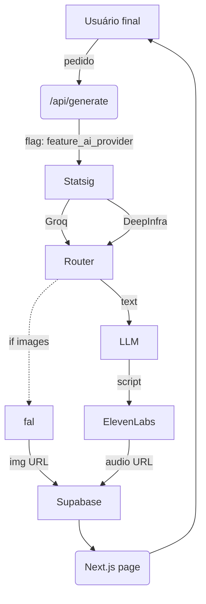

# AI Integration Blueprint

This document summarizes how different integrations fit together in the stack and outlines a suggested improvement plan.

## Integrations Overview

| Integração | Papel na arquitetura | Melhores práticas (Vercel + Next.js) |
|-----------|----------------------|--------------------------------------|
| **fal** | GPU serverless para visão & images generativas | Usar `@fal-ai/serverless-client` em route handlers e armazenar saídas no Supabase Storage para cache/CDN. |
| **ElevenLabs** | TTS e audio enhancement | Integrar via AI SDK (`ai/voice`) para gerar áudio durante o build ou on-demand. Registrar metadados (voz, idioma) no Supabase. |
| **Groq** | LLM ultra-low-latency | Criar provider no AI SDK e usar `streamText()` para chat/embeddings. Combinar com Statsig para testar latência vs custo. |
| **xAI (Grok)** | Modelos compatíveis com OpenAI | Troca "drop-in" lendo `XAI_API_KEY`. Útil como fallback. |
| **Deep Infra** | Catálogo multi-modelo | Manter um roteador de provedores decidindo o modelo via flag Statsig. |
| **Statsig** | Feature flags & A/B testing | Carregar flags em Server Components e registrar eventos de inferência. |
| **Hypertune** | Config runtime de parâmetros | Usar junto do Edge Config para ajustar temperatura, top‑p etc. sem redeploy. |
| **GitHub Issues** | Produtividade Dev-Ops | Abrir issue automática quando um deploy falha ou flag sinaliza erro 5xx. |
| **Supabase** | DB + Auth + Storage | Utilizar RLS para limitar acesso aos assets gerados. |

## Blueprint de Fluxo

O roteador decide qual provedor de LLM utilizar (Groq, Deep Infra, xAI) de acordo com uma flag do Statsig e parâmetros definidos no Hypertune/Edge Config.

## Backlog de Melhorias

| Pri | Ação | Stack | Detalhe |
|-----|------|-------|---------|
| **P0** | Camada de roteamento de provedores | Groq · xAI · DeepInfra · AI SDK | Implementar função `getCompletion(providerFlag)` que decide provedor conforme flag Statsig e experimento de custo/latência. |
| **P0** | Secret & env hardening | Vercel | Verificar se todas as keys estão em Environment Variables e evitar vazamento em client. |
| **P1** | Observabilidade de IA | Statsig · Supabase | Enviar `ai_inference` com tempo e custo e montar dashboard no Supabase. |
| **P1** | Feature ops sem redeploy | Hypertune | Guardar parâmetros (temperature, voice_id, img_style) em Edge Config. |
| **P1** | Pipeline multimídia para VSL | fal · ElevenLabs · Supabase | Endpoint `/api/vsl` gera frames e áudio e guarda no bucket `vsl_assets`. |
| **P2** | Auto‑issue Dev‑Ops | GitHub Issues | Webhook de falha do deploy ou erro de inferência abre issue automática. |
| **P2** | Progressive rollout de modelos | Statsig | Criar flag `%groq_r1_v_production` aumentando porcentagens gradualmente. |

Este plano possibilita um pipeline multimídia completo, controle de rollout e observabilidade centralizada.

\nO código do pipeline VSL encontra-se em `src/services/vsl.ts`.
